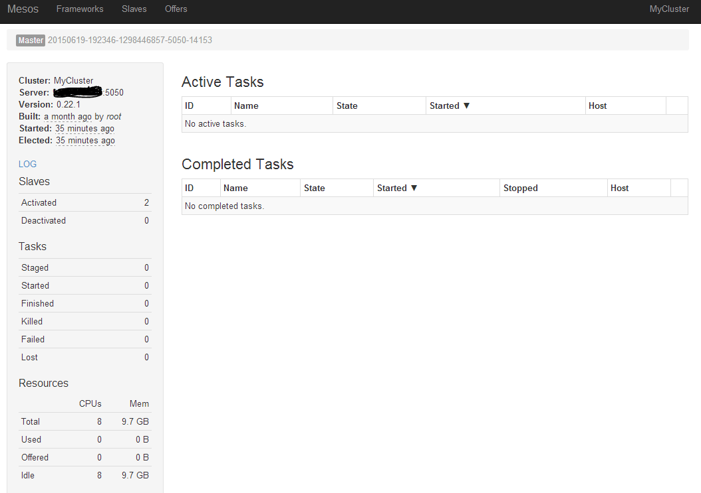
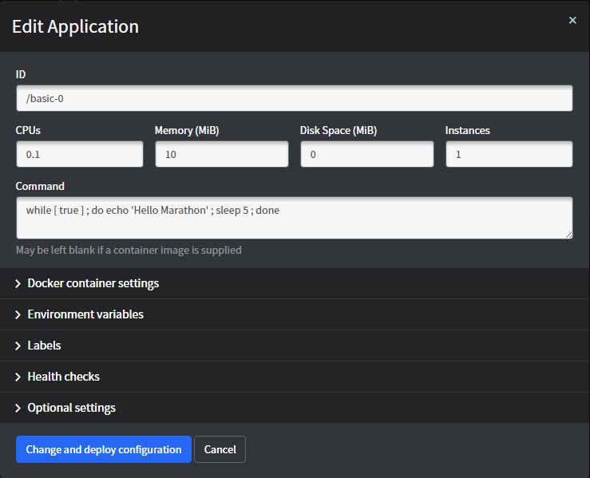

---
categories:
- Docker
tags:
- Docker  
keywords: 知识铺,Docker
date: 2019-11-11T22:27:21+08:00
title: Docker 从入门到实践 - Mesos 安装与使用
author: 知识铺
weight: -1
---

## Mesos 安装与使用
以 Mesos 结合 Marathon 应用框架为例，来看下如何快速搭建一套 Mesos 平台。

Marathon 是可以跟 Mesos 一起协作的一个 framework，基于 Scala 实现，可以实现保持应用的持续运行。

另外，Mesos 默认利用 ZooKeeper 来进行多个主节点之间的选举，以及从节点发现主节点的过程。一般在生产环境中，需要启动多个 Mesos master 服务（推荐 3 或 5 个），并且推荐使用 supervisord 等进程管理器来自动保持服务的运行。

ZooKeeper 是一个分布式集群中信息同步的工具，通过自动在多个节点中选举 `leader`，保障多个节点之间的某些信息保持一致性。

### 安装
安装主要需要 mesos、zookeeper 和 marathon 三个软件包。

Mesos 也采用了经典的主-从结构，一般包括若干主节点和大量从节点。其中，mesos master 服务和 zookeeper 需要部署到所有的主节点，mesos slave 服务需要部署到所有从节点。marathon 可以部署到主节点。

安装可以通过源码编译、软件源或者 Docker 镜像方式进行，下面分别进行介绍。

#### 源码编译

源码编译方式可以保障获取到最新版本，但编译过程比较费时间。

首先，从 apache.org 开源网站下载最新的源码。

```sh
$ git clone https://git-wip-us.apache.org/repos/asf/mesos.git
```

其中，主要代码在 `src` 目录下，应用框架代码在 `frameworks` 目录下，文档在 `docs` 目录下，`include ` 中包括了跟 Mesos 打交道使用的一些 API 定义头文件。

安装依赖，主要包括 Java 运行环境、Linux 上的自动编译环境等。

```sh
$ sudo apt-get update
$ sudo apt-get install -y openjdk-8-jdk autoconf libtool \
build-essential python-dev python-boto libcurl4-nss-dev \
libsasl2-dev maven libapr1-dev libsvn-dev
```

后面就是常规 C++ 项目的方法，configure 之后利用 Makefile 进行编译和安装。

```sh
$ cd mesos
$ ./bootstrap
$ mkdir build
$ cd build && ../configure --with-network-isolator
$ make
$ make check && sudo make install
```

#### 软件源安装

通过软件源方式进行安装相对会省时间，但往往不是最新版本。

这里以 Ubuntu 系统为例，首先添加软件源地址。

```sh
$ sudo apt-key adv --keyserver keyserver.ubuntu.com --recv E56151BF
$ DISTRO=$(lsb_release -is | tr '[:upper:]' '[:lower:]')
$ CODENAME=$(lsb_release -cs)
$ echo "deb http://repos.mesosphere.io/${DISTRO} ${CODENAME} main" | \
sudo tee /etc/apt/sources.list.d/mesosphere.list
```

刷新本地软件仓库信息并安装 zookeeper、mesos、marathon 三个软件包。

```sh
$ sudo apt-get -y update && sudo apt-get -y install zookeeper mesos marathon
```

注意，Marathon 最新版本需要 jdk 1.8+ 的支持。如果系统中有多个 Java 版本，需要检查配置默认的 JDK 版本符合要求。

```sh
$ sudo update-alternatives --config java
```

安装 Mesos 成功后，会在 `/usr/sbin/` 下面发现 `mesos-master` 和 `mesos-slave` 两个二进制文件，分别对应主节点上需要运行的管理服务和从节点上需要运行的任务服务。

用户可以手动运行二进制文件启动服务，也可以通过 `service` 命令来方便进行管理。

例如，在主节点上重启 Mesos 管理服务：

```sh
$ sudo service mesos-master restart
```

通过 `service` 命令来管理，实际上是通过调用 `/usr/bin/mesos-init-wrapper` 脚本文件进行处理。

#### [基于 Docker](https://github.com/sekka1/mesosphere-docker)

需要如下三个镜像。

* ZooKeeper：https://registry.hub.docker.com/u/garland/zookeeper/
* Mesos：https://registry.hub.docker.com/u/garland/mesosphere-docker-mesos-master/
* Marathon：https://registry.hub.docker.com/u/garland/mesosphere-docker-marathon/

其中 mesos-master 镜像在后面将分别作为 master 和 slave 角色进行使用。

首先，拉取三个镜像。

```sh
$ docker pull garland/zookeeper
$ docker pull garland/mesosphere-docker-mesos-master
$ docker pull garland/mesosphere-docker-marathon
```

导出主节点机器的地址到环境变量。

```sh
$ HOST_IP=10.0.0.2
```

在主节点上启动 Zookeepr 容器。

```sh
docker run -d \
-p 2181:2181 \
-p 2888:2888 \
-p 3888:3888 \
garland/zookeeper
```

在主节点上启动 Mesos Master 服务容器。

```sh
docker run --net="host" \
-p 5050:5050 \
-e "MESOS_HOSTNAME=${HOST_IP}" \
-e "MESOS_IP=${HOST_IP}" \
-e "MESOS_ZK=zk://${HOST_IP}:2181/mesos" \
-e "MESOS_PORT=5050" \
-e "MESOS_LOG_DIR=/var/log/mesos" \
-e "MESOS_QUORUM=1" \
-e "MESOS_REGISTRY=in_memory" \
-e "MESOS_WORK_DIR=/var/lib/mesos" \
-d \
garland/mesosphere-docker-mesos-master
```

在主节点上启动 Marathon。

```sh
docker run \
-d \
-p 8080:8080 \
garland/mesosphere-docker-marathon --master zk://${HOST_IP}:2181/mesos --zk zk://${HOST_IP}:2181/marathon
```

在从节点上启动 Mesos slave 容器。

```sh
docker run -d \
--name mesos_slave_1 \
--entrypoint="mesos-slave" \
-e "MESOS_MASTER=zk://${HOST_IP}:2181/mesos" \
-e "MESOS_LOG_DIR=/var/log/mesos" \
-e "MESOS_LOGGING_LEVEL=INFO" \
garland/mesosphere-docker-mesos-master:latest
```

接下来，可以通过访问本地 8080 端口来使用 Marathon 启动任务了。


### 配置说明

下面以本地通过软件源方式安装为例，解释如何修改各个配置文件。

#### ZooKeepr

ZooKeepr 是一个分布式应用的协调工具，用来管理多个主节点的选举和冗余，监听在 2181 端口。推荐至少布置三个主节点来被 ZooKeeper 维护。

配置文件默认都在 `/etc/zookeeper/conf/` 目录下。比较关键的配置文件有两个：`myid` 和 `zoo.cfg`。

myid 文件会记录加入 ZooKeeper 集群的节点的序号（1-255之间）。`/var/lib/zookeeper/myid` 文件其实也是软连接到了该文件。

比如配置某节点序号为 1，则需要在该节点上执行：

```sh
$ echo 1 | sudo dd of=/etc/zookeeper/conf/myid
```

节点序号在 ZooKeeper 集群中必须唯一，不能出现多个拥有相同序号的节点。

另外，需要修改 zoo.cfg 文件，该文件是主配置文件，主要需要添加上加入 ZooKeeper 集群的机器的序号和对应监听地址。

例如，现在 ZooKeeper 集群中有三个节点，地址分别为 `10.0.0.2`、`10.0.0.3`、`10.0.0.4`，序号分别配置为 `2`、`3`、`4`。

则配置如下的三行：

```sh
server.2=10.0.0.2:2888:3888
server.3=10.0.0.3:2888:3888
server.4=10.0.0.4:2888:3888
```

其中第一个端口 2888 负责从节点连接到主节点的；第二个端口 3888 则负责主节点进行选举时候通信。

也可以用主机名形式，则需要各个节点 `/etc/hosts` 文件中都记录地址到主机名对应的映射关系。

完成配置后，启动 ZooKeeper 服务。

```sh
$ sudo service zookeeper start
```

#### Mesos

Mesos 的默认配置目录有三个：

* /etc/mesos/：主节点和从节点都会读取的配置文件，最关键的是 zk 文件存放主节点的信息；
* /etc/mesos-master/：只有主节点会读取的配置，等价于启动 mesos-master 命令时候的默认选项；
* /etc/mesos-slave/：只有从节点会读取的配置，等价于启动 mesos-master 命令时候的默认选项。

最关键的是需要在所有节点上修改 `/etc/mesos/zk`，写入主节点集群的 ZooKeeper 地址列表，例如：

```sh
zk://10.0.0.2:2181,10.0.0.3:2181,10.0.0.4:2181/mesos
```

此外，`/etc/default/mesos`、`/etc/default/mesos-master`、`/etc/default/mesos-slave` 这三个文件中可以存放一些环境变量定义，Mesos 服务启动之前，会将这些环境变量导入进来作为启动参数。格式为 `MESOS_OPTION_NAME`。

下面分别说明在主节点和从节点上的配置。

##### 主节点

一般只需要关注 `/etc/mesos-master/` 目录下的文件。默认情况下目录下为空。

该目录下文件命名和内容需要跟 mesos-master 支持的命令行选项一一对应。可以通过 `mesos-master --help` 命令查看支持的选项。

例如某个文件 `key` 中内容为 `value`，则在 mesos-master 服务启动的时候，会自动添加参数 `--key=value` 给二进制命令。

例如，mesos-master 服务默认监听在 loopback 端口，即 `127.0.0.1:5050`，我们需要修改主节点监听的地址，则可以创建 /etc/mesos-master/ip 文件，在其中写入主节点监听的外部地址。

为了正常启动 mesos-master 服务，还需要指定 `work_dir` 参数(表示应用框架的工作目录)的值，可以通过创建 /etc/mesos-master/work_dir 文件，在其中写入目录，例如 ` /var/lib/mesos`。工作目录下会生成一个 `replicated_log` 目录，会存有各种同步状态的持久化信息。

以及指定 quorum 参数的值，该参数用来表示 ZooKeeper 集群中要求最少参加表决的节点数目。一般设置为比 ZooKeeper 集群中节点个数的半数多一些（比如三个节点的话，可以配置为 `2`）。

此外，要修改 Mesos 集群的名称，可以创建 `/etc/mesos-master/cluster` 文件，在其中写入集群的别名，例如 `MesosCluster`。

总结下，建议在 `/etc/mesos-master` 目录下，配置至少四个参数文件：`ip`、`quorum`、`work_dir`、`cluster`。

修改配置之后，需要启动服务即可生效。
```sh
$ sudo service mesos-master start
```

更多选项可以参考后面的配置项解析章节。

主节点服务启动后，则可以在从节点上启动 mesos-slave 服务来加入主节点的管理。

##### 从节点
一般只需要关注 `/etc/mesos-slave/` 目录下的文件。默认情况下目录下为空。

文件命名和内容也是跟主节点类似，对应二进制文件支持的命令行参数。

建议在从节点上，创建 `/etc/mesos-slave/ip` 文件，在其中写入跟主节点通信的地址。

修改配置之后，也需要重新启动服务。

```sh
$ sudo service mesos-slave start
```

更多选项可以参考后面的配置项解析章节。

#### Marathon
Marathon 作为 Mesos 的一个应用框架，配置要更为简单，必需的配置项有 `--master` 和 `--zk`。

安装完成后，会在 /usr/bin 下多一个 marathon shell 脚本，为启动 marathon 时候执行的命令。

配置目录为 `/etc/marathon/conf`（需要手动创建），此外默认配置文件在 `/etc/default/marathon`。

我们手动创建配置目录，并添加配置项（文件命名和内容跟 Mesos 风格一致），让 Marathon 能连接到已创建的 Mesos 集群中。

```sh
$ sudo mkdir -p /etc/marathon/conf
$ sudo cp /etc/mesos/zk /etc/marathon/conf/master
```

同时，让 Marathon 也将自身的状态信息保存到 ZooKeeper 中。创建 `/etc/marathon/conf/zk` 文件，添加 ZooKeeper 地址和路径。

```sh
zk://10.0.0.2:2181,10.0.0.2:2181,10.0.0.2:2181/marathon
```

启动 marathon 服务。

```sh
$ sudo service marathon start
```

### 访问 Mesos 图形界面

Mesos 自带了 Web 图形界面，可以方便用户查看集群状态。

用户在 Mesos 主节点服务和从节点服务都启动后，可以通过浏览器访问主节点 5050 端口，看到类似如下界面，已经有两个 slave 节点加入了。



通过 Slaves 标签页能看到加入集群的从节点的信息。

如果没有启动 Marathon 服务，在 Frameworks 标签页下将看不到任何内容。

### 访问 Marathon 图形界面

Marathon 服务启动成功后，在 Mesos 的 web 界面的 Frameworks 标签页下面将能看到名称为 marathon 的框架出现。

同时可以通过浏览器访问 8080 端口，看到 Marathon 自己的管理界面。


此时，可以通过界面或者 REST API 来创建一个应用，Marathon 会保持该应用的持续运行。



通过界面方式可以看到各任务支持的参数（包括资源、命令、环境变量、健康检查等），同时可以很容易地修改任务运行实例数进行扩展，非常适合进行测试。

如果要更自动化地使用 Marathon，则需要通过它的 REST API 进行操作。

一般的，启动新任务需要先创建一个定义模板（JSON 格式），然后发到指定的 API。

例如，示例任务 basic-0 的定义模板为：

```json
{
    "id": "basic-0",
    "cmd": "while [ true ] ; do echo 'Hello Marathon' ; sleep 5 ; done",
    "cpus": 0.1,
    "mem": 10.0,
    "instances": 1
}
```

该任务申请资源为 0.1 个单核 CPU 资源和 10 MB 的内存资源，具体命令为每隔五秒钟用 shell 打印一句 `Hello Marathon`。

可以通过如下命令发出 basic-0 任务到 Marathon 框架，框架会分配任务到某个满足条件的从节点上，成功会返回一个 json 对象，描述任务的详细信息。

```sh
$ curl -X POST http://marathon_host:8080/v2/apps -d @basic-0.json -H "Content-type: application/json"
{"id":"/basic-0","cmd":"while [ true ] ; do echo 'Hello Marathon' ; sleep 5 ; done","args":null,"user":null,"env":{},"instances":1,"cpus":0.1,"mem":10,"disk":0,"executor":"","constraints":[],"uris":[],"storeUrls":[],"ports":[0],"requirePorts":false,"backoffSeconds":1,"backoffFactor":1.15,"maxLaunchDelaySeconds":3600,"container":null,"healthChecks":[],"dependencies":[],"upgradeStrategy":{"minimumHealthCapacity":1,"maximumOverCapacity":1},"labels":{},"acceptedResourceRoles":null,"version":"2015-12-28T05:33:05.805Z","tasksStaged":0,"tasksRunning":0,"tasksHealthy":0,"tasksUnhealthy":0,"deployments":[{"id":"3ec3fbd5-11e4-479f-bd17-813d33e43e0c"}],"tasks":[]}%
```

Marathon 的更多 REST API 可以参考本地自带的文档：`http://marathon_host:8080/api-console/index.html`。

此时，如果运行任务的从节点出现故障，任务会自动在其它可用的从节点上启动。

此外，目前也已经支持基于 Docker 容器的任务。需要先在 Mesos slave 节点上为 slave 服务配置 `--containerizers=docker,mesos` 参数。

例如如下面的示例任务：

```json
{
  "id": "basic-3",
  "cmd": "python3 -m http.server 8080",
  "cpus": 0.5,
  "mem": 32.0,
  "container": {
      "type": "DOCKER",
      "volumes": [],
      "docker": {
        "image": "python:3",
        "network": "BRIDGE",
        "portMappings": [
          {
            "containerPort": 8080,
            "hostPort": 31000,
            "servicePort": 0,
            "protocol": "tcp"
          }
        ],
        "privileged": false,
        "parameters": [],
        "forcePullImage": true
      }
  }
}
```

该任务启动一个 `python:3` 容器，执行 `python3 -m http.server 8080` 命令，作为一个简单的 web 服务，实际端口会映射到宿主机的 31000 端口。

注意区分 hostPort 和 servicePort，前者代表任务映射到的本地可用端口（可用范围由 Mesos slave 汇报，默认为 31000 ~ 32000）；后者作为服务管理的端口，可以被用作一些服务发行机制使用进行转发，在整个 Marathon 集群中是唯一的。

任务执行后，也可以在对应 slave 节点上通过 Docker 命令查看容器运行情况，容器将以 `mesos-SLAVE_ID` 开头。

```sh
$ docker container ls
CONTAINER ID        IMAGE               COMMAND                  CREATED             STATUS              PORTS                     NAMES
1226b4ec8d7d        python:3            "/bin/sh -c 'python3 "   3 days ago          Up 3 days           0.0.0.0:10000->8080/tcp   mesos-06db0fba-49dc-4d28-ad87-6c2d5a020866-S10.b581149e-2c43-46a2-b652-1a0bc10204b3
```
